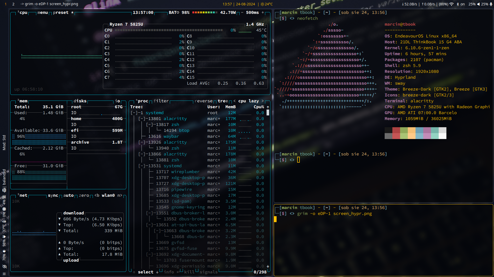

## Hyprland

- **Window manager** • [Hyprland](https://github.com/hyprwm/Hyprland) with [Hy3](https://github.com/outfoxxed/hy3) plugin
- **Shell** • [Zsh](https://www.zsh.org) with *xiong-chiamiv-plus* theme
- **Termina** • [Alacritty](https://github.com/alacritty/alacritty)
- **Panel** • [Waybar](https://github.com/Alexays/Waybar) with Hyprland features
- **Notify daemon** • [Mako](https://github.com/emersion/mako)
- **App launcher** • [Wofi](https://sr.ht/~scoopta/wofi/)

## Sway

- **Window manager** • [Sway](https://github.com/swaywm/sway)
- **Shell** • [Zsh](https://www.zsh.org) with *xiong-chiamiv-plus* theme
- **Termina** • [Alacritty](https://github.com/alacritty/alacritty)
- **Panel** • [Waybar](https://github.com/Alexays/Waybar)
- **Notify daemon** • [Mako](https://github.com/emersion/mako)
- **App launcher** • [Wofi](https://sr.ht/~scoopta/wofi/)

